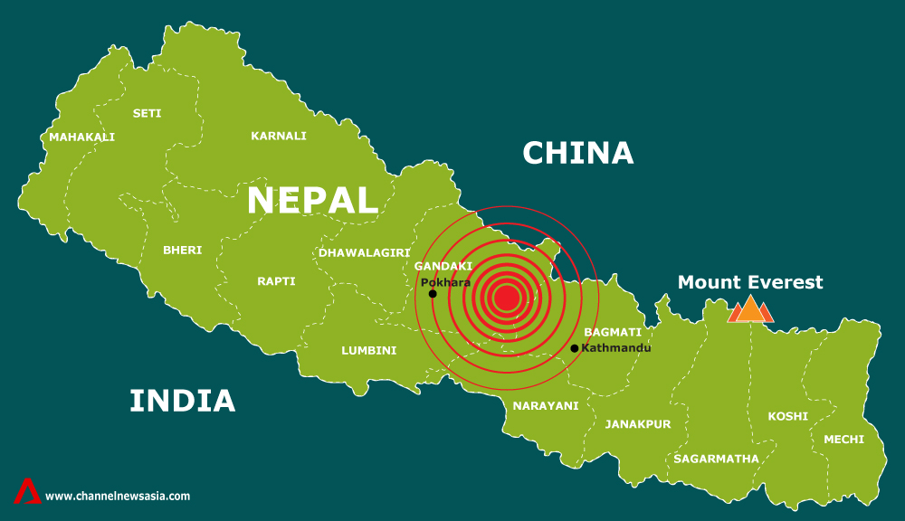
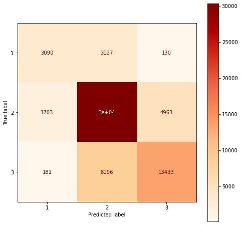

# Richter-s-Predictor
Kyongmin's Capstone Project

Data Science Student 

[LinkedIn](https://www.linkedin.com/in/kyongminso/) | [GitHub](https://github.com/kyongminso) | [Email](mailto:kyongminso@gmail.com)



# Business Understanding
In April 2015, an earthquake (also known as the **Gorkha Earthquake**) hit central Nepal with a magnitude of 7.8. It killed an estimate of 9 thousand people and injured more than 20 thousand people. It was the worst natural disaster to hit Nepal since the 1930's. 

This earthquake flattened out countless villages and communities throughtout Nepal. Nepal is already one of the poorest Asian countries with a GDP of about $20 billion dollars and had no abilities to reconstruct themselves needing to rely on foreign aid to get back up on their feet. This country was absolutely not prepared for this catastrophe and they paid massively for their consequences for not being prepared.


Something that intrigued me was that that 2 years prior to the earthquake in 2013, a seismologist named Vinod Kumar Gaur was interviewed and he was quoted saying: "Calculations show that there is sufficient accumulated energy, now to produce an 8 magnitude earthquake. I cannot say when. It may not happen tomorrow, but it could possibly happen sometime this century, or wait longer to produce a much larger one." 

People were aware of the earthquake but they were confident that the earthquake wouldn't happen for a long time and the people of Nepal eventually paid the price for it. Part of the reason why I was so interested in doing this is to see what the buildings were made out of and see if there are any connections to the damage of the building and the material used to construct the buildings. Hopefully with my studies,I can figure out what building materials are detrimental in earthquakes, and make sure that any other buildings made of the same material are documented and are best restructured so that the damage when an earthquake happens the aftermath will not be that detrimental.

[Source](https://en.wikipedia.org/wiki/April_2015_Nepal_earthquake)


# Business Problem
A lot of the homes in Nepal are built by poor materials and in 2015, people were not ready for the earthquake. My model is going to predict the damage of a building in Nepal based off of the features of the building. Based off what my model predicts, people could be better prepared for an earthquake and can go reinforce the buildings so people will be better prepared.


# Overview 
This model is going to predict the damage of the buildings based off what the features of the building are. 

#### **Modeling** 
------------------------
The models that I will be running for this project are: 

- **Logistic Regression (1st Simple Model)** 
- **Random Forests**
- **XG-Boost** 
- **K-Nearest Neighbors**


I am using these models because these are the basic classification models I can use. These are good for binary classification models, but these can also be used for multi-class classification. These models are used on the trained dataset and are filled with features describing the building.


# Data
All of my data was obtained through this website [Driven Data](https://www.drivendata.org/competitions/57/nepal-earthquake/) but you will need an account to access the information. I will not use all the features and if I start dropping anything, I will explain why I dropped certain features.


Our dataset is filled with features describing each buildings with columns such as: 
- **age**
- **area_percentage**
- **has_superstructure_rc_engineered**
- and more.

Our target is the **damage_grade** and it is based off of 3 levels. Each building is associated with one of these 3 answers.
- 1 = Least Damage 
- 2 = Middle Damage 
- 3 = Heavy Damage 


As for my other features,as you move on through the notebook, all of my features will be explained and dropped as you move on. 


**Something to know**

This data is based off of damages from an earthquake that was registered at a 7.8 ~ 8.0 earthquake and the Richter Scale max is 8.8 or 8.9 (depending on who you ask). My model will predict off of earthquakes that are on the more severe and dangerous side of the scale so my findings will be based off of earthquakes that are stronger than 7.0. 

**Scoring Metrics**

I am predicting the level of damage from a scale of 1 to 3. The level of damage is an ordinal so that means the order matters. This can be viewed as a classification or an ordinal regression problem.

We will be using the the F1 score which balances the precision and recall of a classifier. Normally we use the F1 score for binary situations but since we have three labels we are dealing with, we will be using the **micro** averaged F1 score. Micro F1 is used to assess the quality of multi-label binary problems. It basically measures the F1-score of the aggregated contributions of all classes. 

Just a refresher: 
- Precision : Out of all of the positive predictions, how many are really positive?
- Recall : Of all the true positive cases, how many were predicted positive? 
- F1 Score: The harmonic mean between the Precision and the Recall 

Basically, **micro F1 score** performed by first calculating the sum of all true positives, false positives, and false negatives over all the labels. Then I compute the micro-precision and micro-recall from the sums.Finally we compute the harmonic mean to get the micro F1-score.

I will also find the **macro** F1 score too because why not? **macro** scores are just gathering all the f1 scores per class and dividing it by the number of classes.

# Results
My best model was my **Random Forest** as it gave me a micro-F1 score of almost **72%**.




My confusion matrix had some issues with predicting the damage 1 class, but it was phephenomenal at predicting the majority class of damage 2. For my level 3 damage, it was able to predict the majority but level 2 damage was for sure involved with the prediction for this target class.

# App 

I am recording myself using the app locally.


# Limitations
I was limited with computing power. One of models ran for more than 13 hours and I was not able to pull out the results. Next time, I will need a stronger computer and hopefully more money so I can spend money on Google Co-Lab. 

# Conclusion 
In the end, I built a predictive model using the Micro F1-Score off of the 2015 earthquake in Nepal using information from [Driven Data](https://www.drivendata.org/competitions/57/nepal-earthquake/). I was able to do some data cleaning and I made a dataframe and using that dataframe, I built a pipeline and I was able to use multiple algorithms for my categorical data. A lot of my models took a lot of computational power, and I even ended up cutting my grid search short. 

Overall, I got a micro- F1 score that crossed over 70% and I was pleased with that. The model I decided to run with was my **Random Forest** because it gave me my best score. I was able to pull out the best features and I was able to see a correlation to see the impact that my features had on my prediction. I was also able to build a histogram to see if the certain building materials were prevalent in earthquake damages. There is definitely much more that I could've explored but that's just something I will have to do later when I have more time and save enough money to buy a super computer. Overall, the location of the city matters, the closer you are to the epicenter, the more likely the damage will be more detrimental. I believe this model could save lives by reinforcing homes that are closer to earthquake disaster areas and start by building off of bricks ,try not to build your home off of mud_mortar_stonem, and if your foundation is built off of **'r'**, I would try to reinforce that either with **u** or **i**. 


# Next Steps
- Gather more information on my data 
    - My data has some information that doesn't make any sense as they only give us one lettered answers. I would dig further into this data and see if I can translate my data into something that is translatable.
- Explore more of the data
    - Spend more time doing EDA. Play around with the features and see if I can improve my scores.
    - Try and see if I can find more datasets that could help improve my model. 
- Run more models
    - Run more grid searches and play around with my models too. Obviously we want to try for a better score.
- Invest more money into Nepal
    - Nepal is ranked [100](https://countryeconomy.com/gdp/nepal#:~:text=The%20GDP%20figure%20in%202020,2019%2C%20when%20it%20was%20%241%2C195.) in the world. Millions of dollars have been poured into the country, but almost 10 years after the earthquake, the country is still struggling trying to get back onto it's feet.
    - Help funding for homes using ground_floor_type 'v', and for any homes made of mud_mortar_stone, try your best to reinforce it, and for any new homes being built you can use brick to help withstand the damages.

# Repository Structure 
```
├── [Images]
│    ├── Screen Shot 2022-05-31 at 17.40.10(2).png
│    ├── brick_histogram.png
│    ├── brick_histogram_2.png
│    ├── final_confusion_matrix.png
│    ├── mud_mortar_stone_histogram.png
│    ├── nepal-quake-map-data.jpeg
│    ├──target_histogram.png
│    ├──target_histogram_2.png
│    ├──timber_histogram.png
├── [Model]
│    ├──XG_boost.sav
├── .gitignore
├── LICENSE
├── Main Notebook.ipynb
├── README.md
└── functions.py
```

# Citations/ References

[Saad Saeed](https://github.com/ssaeed85)

[Xiaohua Su](https://github.com/xiaohua-su)

[Wikipedia]((https://en.wikipedia.org/wiki/April_2015_Nepal_earthquake))

[Data for project]((https://www.drivendata.org/competitions/57/nepal-earthquake/))

[Website of where the data originally stemmed from.]((https://eq2015.npc.gov.np/#/download))